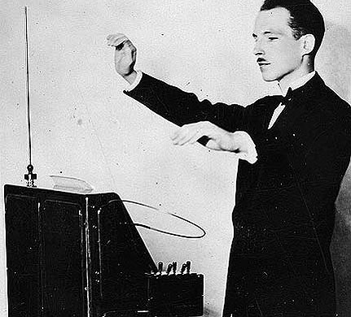

CURSO: Eletrônica Industrial

TURMA: PIN20303 - Projeto integrador 1

Professor: Luis Carlos Martinhago Schlichting e Luiz Alberto de Azevedo

Aluno: André Luiz e Rennan Gonçalves da Silva

-----------

# Introdução do projeto - Theremin 

O que é o Theremin?

Um dos primeiros instrumentos musicais completamente eletrônico, desenvolvido pelo físico e músico russo Lev Sergeivich Termen (Léon Theremin) em 1920 e patenteado em 1927. 

figura 1 - Lev Sergeivich Termen tocando theremin.

Além de não parecer com nenhum outro instrumento, o theremin é único porque é tocado sem ser tocado pelo musico. Isto é proporcionado por dois campos de controles em volta das antenas, que uma delas controla o volume e a outra a tonalidade. Quando uma mão se aproxima da antena vertical, o tom fica mais alto. Aproximar-se da antena horizontal torna o volume mais suave. Como não há contato físico do musico com o instrumento, tocar o theremin de uma maneira melódica precisa requer habilidade prática e muita atenção as antenas. 

