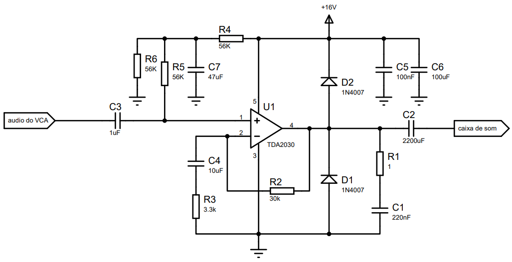
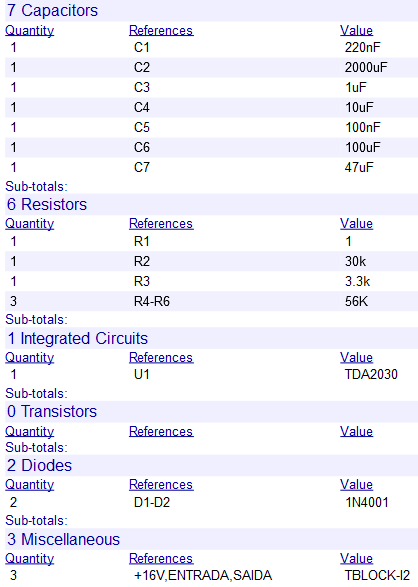
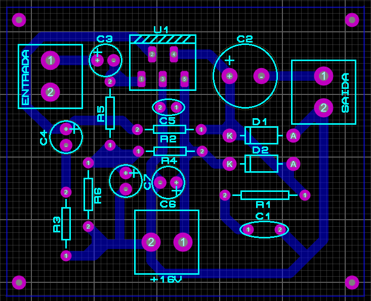

# Projetar - Estrutura amplificadora de potência

Para o desenvolvimento da estrutura amplificadora de potência foi ulitlizado o TDA2030. O TDA2030 possui algumas caracteristicas desejadas para este projeto que são:

-   Aceita alimentação não simétrica;
-   Amplificador com potência máxima de 14W (potência razoável);
-   Tecnologia Hi-Fi(baixo ruido na amplificação para um som agradável);
-------
A seguir temos o circuito do amplificador.

-------
Irei dar uma breve descrição do motivo de cada componente.
- D1,D2: Para proteger o dispositivo contra picos de tensão de saída.
- R2,R3: determina o ganho da estrutura amplificadora. No nosso caso para um ganho próximo a 10.
- R4,R5,R6: determinar meio Vcc na entrada possitiva do amplificador para não haver saturação ao amplificar o sinal de entrada.
- C7: Filtro para reduzir ruido após o a divisão de tensão de R4 com R6;
- C2,C3: Desacoblador de nivel DC;
- C5,C6: Filtro para altas frequência proveniente da alimentação.
- R1 e C1: Estabilidade de frequência.

A seguir temos a lista de componentes.

- Os resistores utilizados são de 1/4W, menos o de 1 ohm que é de 1W.
- Os capacitores eletrolíticos são de 25V e poliester de 63V.
------
A seguir temos o roteamento da PCI no software "Proteus".

O projeto para corossão está disponibilizado na pasta.
