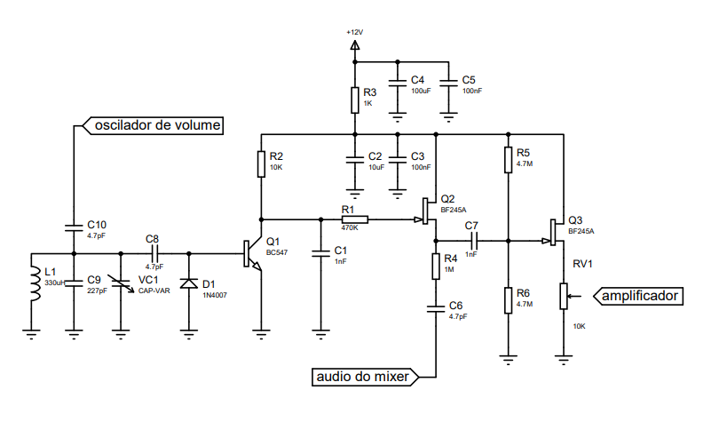
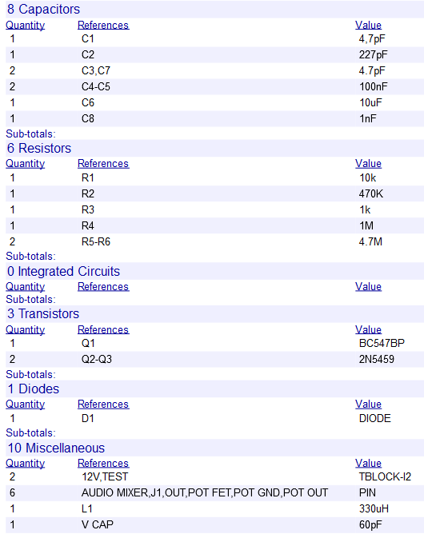
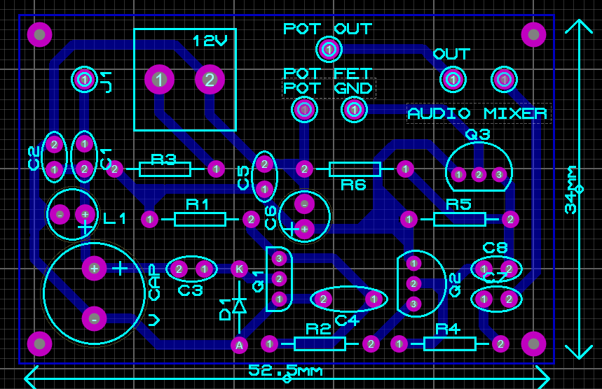

# Projetar - Oscilador Variável de Volume

Esta topologia para o amplificador controlado por tensão é indicada pelo site "Strange Apparatus".

-------
A seguir temos o circuito do Amplificador Controlador por Tensão (VCA) e uma breve descrição da utilização de cada componente.

- C10, L1, C9, C8, VC1: O conjunto destes compenentes é um circuito passa faixa com alto fator qualidade com ajuste da banda passanate;
- D1: Limita tensão no semiciclo negativo da senoide no nó da base do transistor npn;
- Q1: Limita tensão no semiciclo positivo da senoide no nó da base do transistor e ele que define tensão no gate do transistor nmos, assim regulando a estrutura amplificadora;
- C2, C3, C4, C5: Filtro para altas frequências;
- R2: Ajustar corrrente no ramo para ajuste de Vce;  //limitar corrente de carga de C1
- R1: Limitar corrente de carga de gate;  //
- R3:
- C1:
- R5, R6: divisor de tensão para meio VCC no nó gate do transistor nmos;
- C7, C6: Capacitor desacoplador de nivel DC.
- R4: 

- Os resistores utilizados são de 1/4W.
- Os capacitores eletrolíticos são de 25V e poliester de 63V.
- Os indutores de baixa potência.
------
A seguir temos o roteamento da PCI no software "Proteus".

O projeto para corossão está disponibilizado na pasta.
