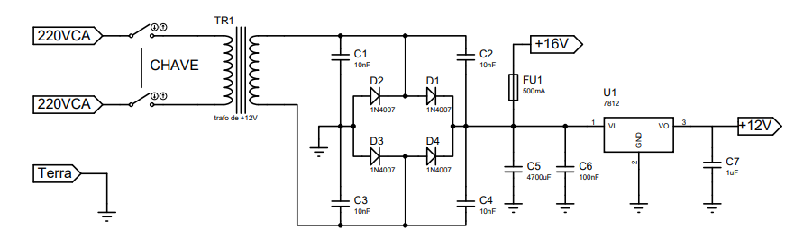

# Projetar - Fonte de alimetação

Para o desenvolvimento da fonte de alimentação do theremin, foi determinado verificando os demais circuito de duas tensões DC sendo elas +12V e +16V. Utilizando um transformador de +12VCA após a ponte retificador com o filtro capacitivo temos um tensão próxima do +16V desejada, e para +12V utilizaremos um regulador de tensão de 12V.

-------

A seguir temos o circuito de alimetação do theremin.

-------

Irei dar uma breve descrição do motivo de cada componente.

- TR1: Transformador é todo dispositivo capaz de transferir a energia elétrica proveniente de uma fonte de corrente alternada para um  circuitos elétricos com tensão superior ou inferior à inicial. No nosso caso uma tenssão de +12VCA.
- D1,D2,D3,D4: Os quatros diodos formam uma ponte retificadora que corresponde aos circuitos elétricos elaborados para a conversão de corrente alternada em contínua. No nosso caso um circuito retificador de onda completa.
- C1,C2,C3,C4: Reduzir o ruido conduzido da rede, tem funcionamento parecido ao um filtro para a carga que é o theremin.
- C5,C6: Filtro capacitivo servem para eliminar uma tensão alternada pulsativa conveniente do transformador e transformá-la em uma (tensão contínua) ou com menor variação.
- U1: É um regulador de tesão de 12V.
- C7: Capacitor utilizado para filtro de alta frequência provenientes do reguladorde tensão.
- CHAVE: Importante lembrar da chave para ligar e desligar o circuito ao todo.