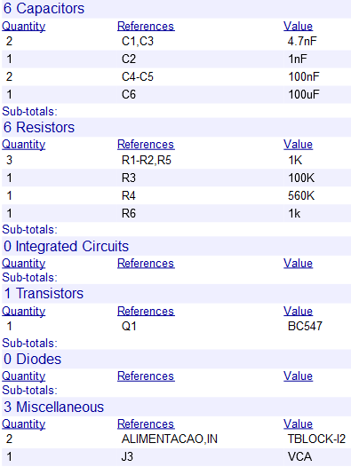
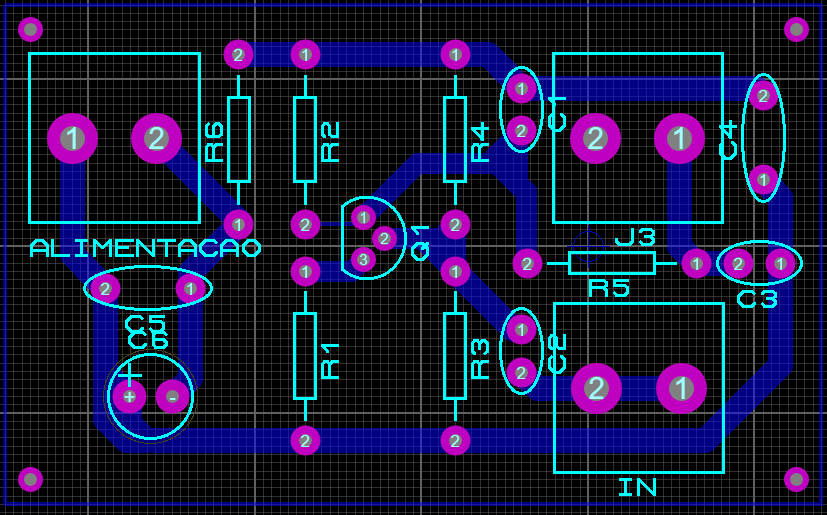

# Projetar - Mixer

Para o desenvolvimento do mixer foi utilizado uma estrutura simples com transistor de junção bipolar.

-------
A seguir temos o circuito do mixer.

-------
A seguir temos a lista de componentes.

- Os resistores utilizados são de 1/4W.
- Os capacitores eletrolíticos são de 25V e poliester de 63V.
------
A seguir temos o roteamento da PCI no software "Proteus".

O projeto para corossão está disponibilizado na pasta.
