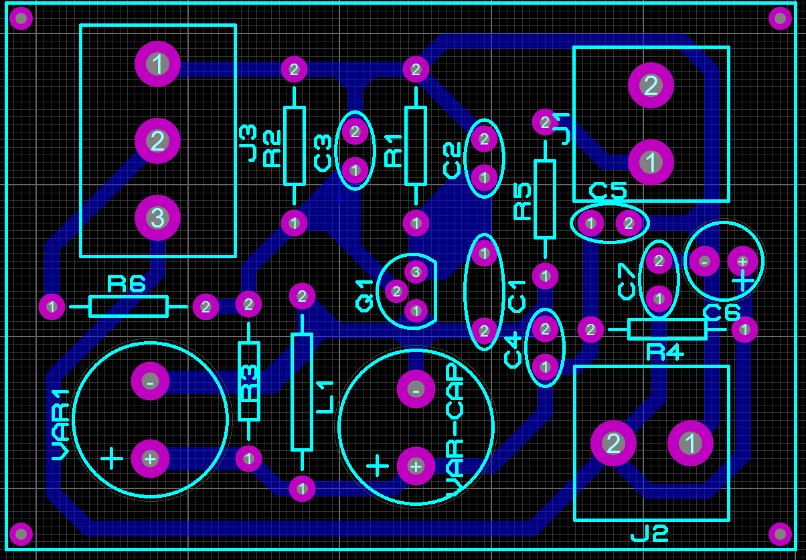

# Projetar - Oscilador Referência de Tom

Esta topologia para o oscilador Referência de tom é indicada pelo site "Strange Apparatus".

-------
A seguir temos o circuito do Oscilador Referência de Tom e uma breve descrição de cada componente:

-------
A seguir temos a lista de componentes.

- Os resistores utilizados são de 1/4W.
- Os capacitores eletrolíticos são de 25V e poliester de 63V.
- O indutor de baixa potência.
------
A seguir temos o roteamento da PCI no software "Proteus".

O projeto para corossão está disponibilizado na pasta.
