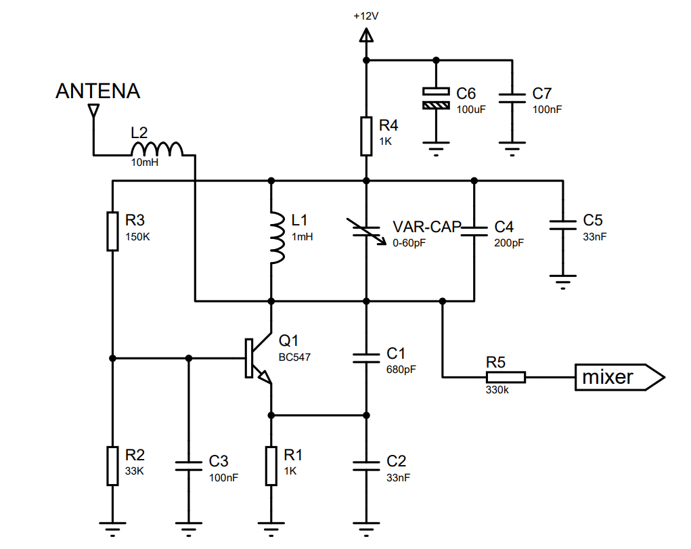
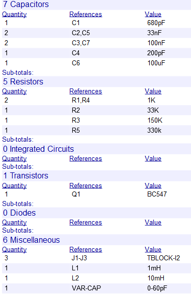
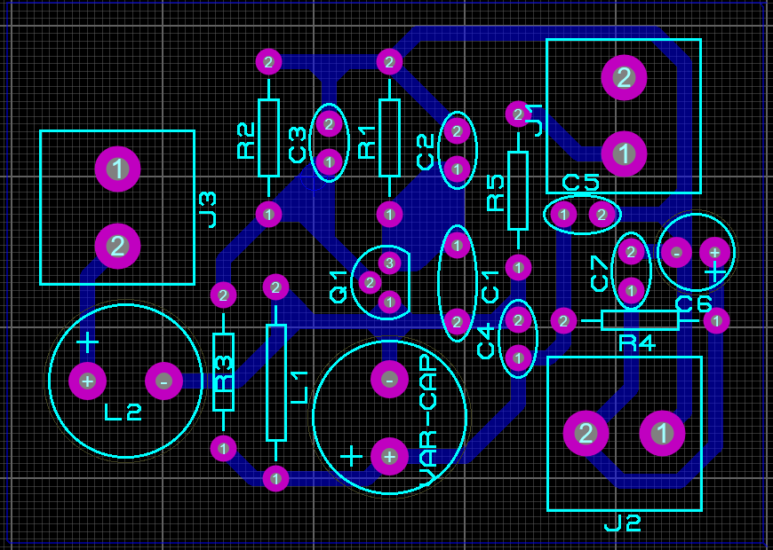

# Projetar - Oscilador Variável de Tom

Esta topologia para o oscilador variável de tom é indicada pelo site "Strange Apparatus".

-------
A seguir temos o circuito do Oscilador Variável de Tom e uma breve descrição de cada componente:

- L2: Este indutor tem como função  melhorar o casamento da impedancia complexa, logo, causando uma maior sensibilidade do circuito a capacitância gerada pela antena.
- C6,C7: Filtro para altas frequência proveniente da alimentação.
-------
A seguir temos a lista de componentes.

- Os resistores utilizados são de 1/4W.
- Os capacitores eletrolíticos são de 25V e poliester de 63V.
- Os indutores de baixa potência.
------
A seguir temos o roteamento da PCI no software "Proteus".

O projeto para corossão está disponibilizado na pasta.
