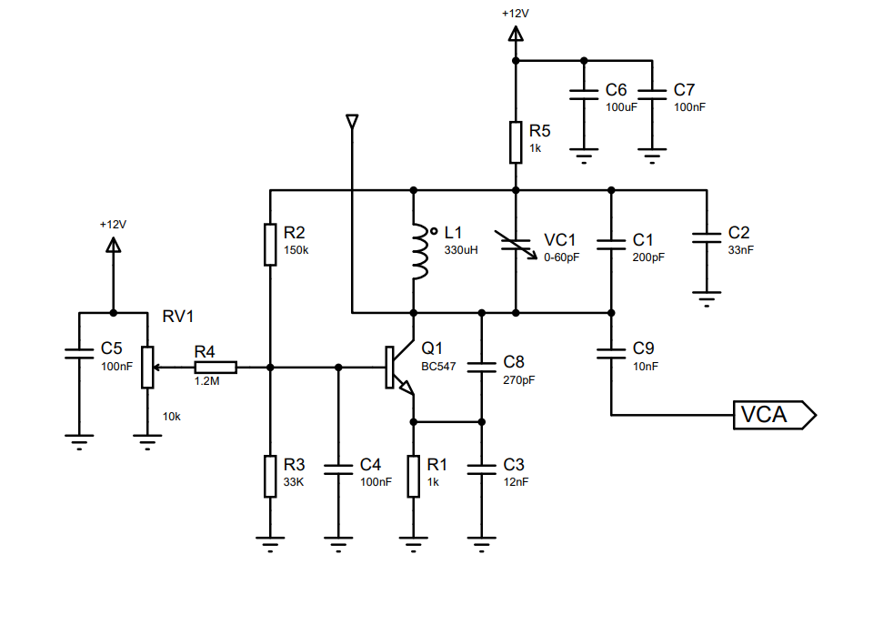

# Projetar - Oscilador Variável de Volume

Esta topologia para o oscilador variável de volume é indicada pelo site "Strange Apparatus".

-------
A seguir temos o circuito do Oscilador Variável de Tom e uma breve descrição da utilização de cada componente..

- R2, R3, C4, R1: Estrutura amplificadora do oscilador;
- C4, C5, C6, C7: filtro para altas frequências;
- RV1,R4: regula ganho da estrutura amplificadora.
- L1, VC1, C1, C2, C3, C8: Compoem o circuito tank que determina a frequência de oscilação.
- C9: Capacitor de desacoplamento.

- Os resistores utilizados são de 1/4W.
- Os capacitores eletrolíticos são de 25V e poliester de 63V.
- Os indutores de baixa potência.
------
A seguir temos o roteamento da PCI no software "Proteus".

O projeto para corossão está disponibilizado na pasta.
