# sumario 
1.  Introdução
2. Concepção 
3. Designer
4.  Implementação
5.  Operação
6.  Referencias

# INTRODUÇÂO

O Theremin é um instrumento musical completamente eletrônico da década de 20 criado pelo físico e inventor  lev sergeivitch termen figura 1, contemporâneo dos primeiros aparelhos de rádio e eletrônicos. É um dispositivo simples de rádio frequência que depende da interação do corpo humano e de 3 osciladores e duas antenas para produzir uma faixa de notas musicais de amplitude variável.
 Vários artista e bandas usaram ele na careiras musicais, dentre ele o Led Zeppelin como mostra na figura 4
 Atualmente ele pode ser encontrado com diversas tecnologias tanto analógica quanto digital e de diversos tamanho como mostrado abaixo na figura 2 um mini thremin um analógico figura 3,e um feito com um arduino  digital como na figura 5 e um valvulado figura 6.

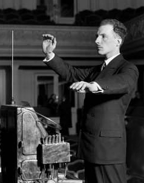

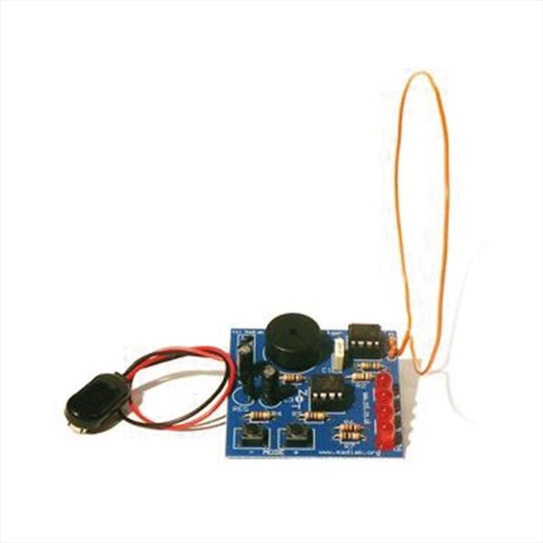 

 

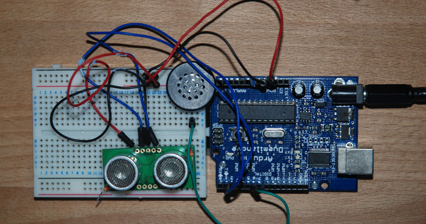

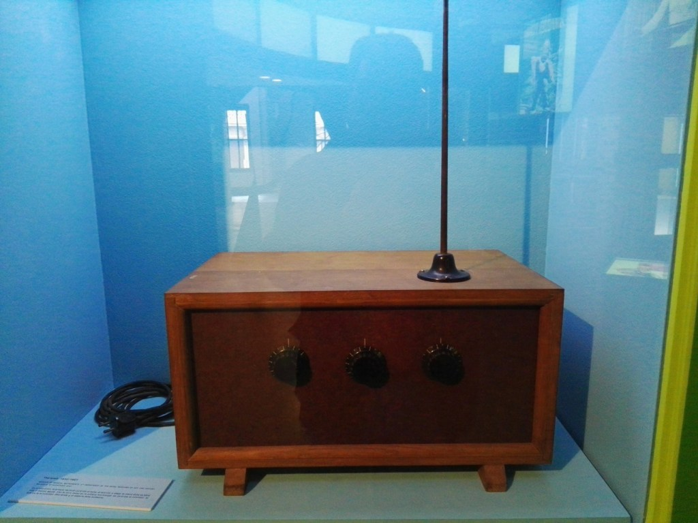 

 
 # CONCEPÇÃO

  Como mostrando anteriormente o Theremin que sera construido sera um analogico com componetes discretos e ou amplificadores operacionais e duas antenas de tom e volume, e esse projeto foi dividido em 7 grandes blocos "circuitos" para a sua concepção,esses 7 blocos sao  

1. Oscilador de tom (frequência) de referência
2. Oscilador de tom controlável
3. Oscilador de volume (amplitude) controlável
4. Mixer
5. VCA (Circuito ressonante de volume e amplificador controlado por tensão)
6. Amplificador de potência
7. Fonte de alimentação

A figura 7 esta mostrado nela o diagrama de blocos completo com todas esses blocos.

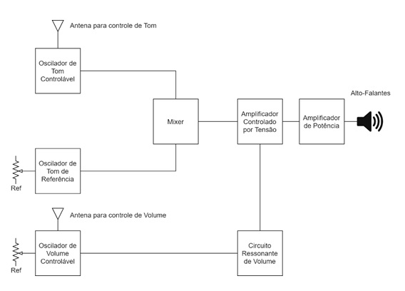 

# DESIGNER

Irei abaixo mostrar todos os blocos separados e o que eles realizam. 

 Oscilador de tom (frequência) de referência
 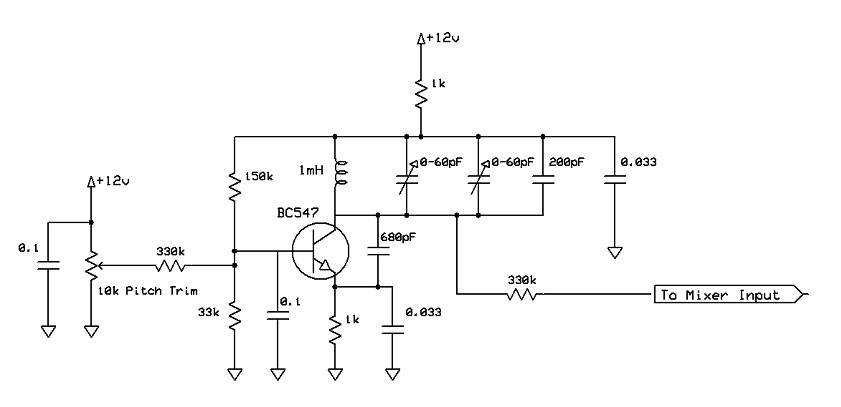 
 O oscilador de referência de tom opera em torno de uma frequencia fixa e é ajustado para a freqüência correta pelo operador usando o potenciômetro.Um pequeno indutor de núcleo de ferrite e vários capacitores formam a rede de determinação de frequência. O sinal de saída de uma frequencia fixa, deste oscilador  alimenta ao módulo do mixer.

 Oscilador de tom controlável
 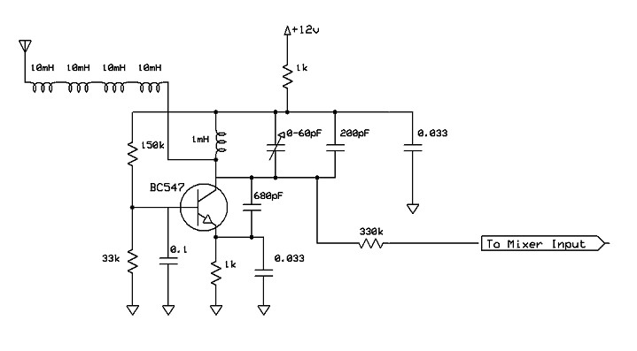
 O oscilador controlável  também funciona com uma frequencia fixa e é influenciado pela capacitância parasita associada à antena de tom. A finalidade dos indutores é melhorar a linearidade da relação entre a posição da mão do usuario e o tom. Sem esses componentes, o campo de Theremin subiria lentamente no início e, de repente, subiria através de várias oitavas em apenas alguns milímetros de movimento da mão dificultando a execução do instrumento. Como esses indutores formam um circuito ressonante em série com capacitância parasita associada à antena. Alcançando a melhor relação movimento / inclinação da mão. A saída deste oscilador também é alimentada ao módulo do mixer.

 Oscilador de volume (amplitude) controlável
  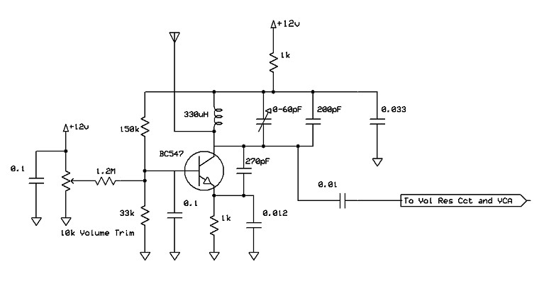 
  O oscilador de volume opera em uma frequencia fixa e é fortemente influenciado pela antena de volume. Quando ajustada corretamente, e a mão do operador está quase tocando a antena, a frequência desse oscilador corresponderá à sintonização do circuito ressonante de volume. Essa condição faz com que o sinal máximo apareça no circuito sintonizado e corresponde ao corte de áudio.

 Mixer
 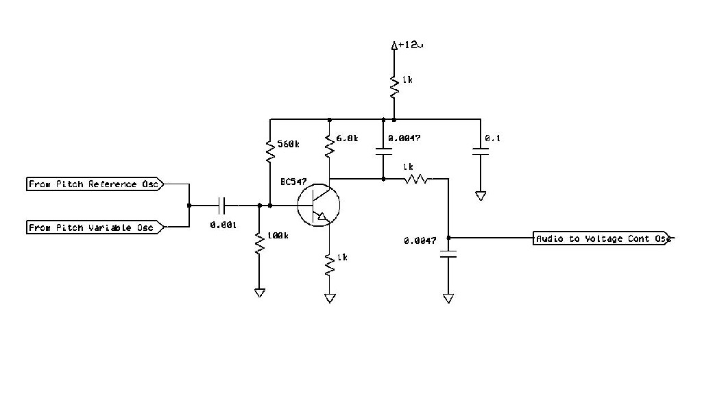 
 O mixer não requer ajustes,Sua função é misturar os sinais dos dois osciladores para produzir um sinal de áudio. Como o mixer é alimentado com as duas freqüências de oscilador ligeiramente diferentes, ele produz uma forma de onda complexa em sua saída como resultado. Se a forma de onda de saída fosse analisada, ver-se-ia que ela realmente continha duas frequências, uma equivalente à adição das freqüências de entrada e outra equivalente à subtração (ou diferença) das duas freqüências de entrada. Como o primeiro seria inaudível e inútil para o nosso propósito, usamos um filtro passa baixas.

  VCA
  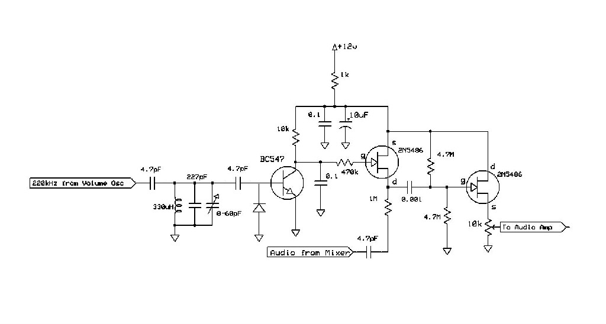
  Este módulo altera o volume do Theremin em resposta aos gestos da mão do jogador. Consiste em um circuito ressonante sintonizado na mesma frequência que o produzido pelo oscilador de volume quando a mão do usuario está próxima da antena. Isso o circuito sintonizado. À medida que a mão do usuario se afasta da antena de volume, a frequência do oscilador de volume também se afasta da frequência de ressonância do circuito sintonizado.

  Amplificador de potência
   
   O amplificador de áudio usa um amplificador monolítico,o circuito vem diretamente da folha de dados do fabricante.

 Fonte de alimentação
 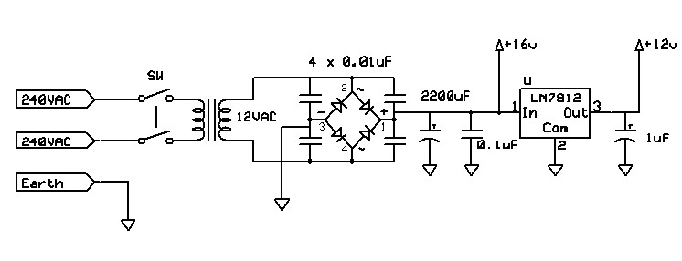
 A fonte de alimentação usa um transformador de , retificador de ponte e um regulador de tensão de 3 terminais. Os capacitores dos diodos retificadores são necessários para reduzir o ruído induzido no modo comum.

