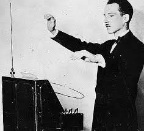
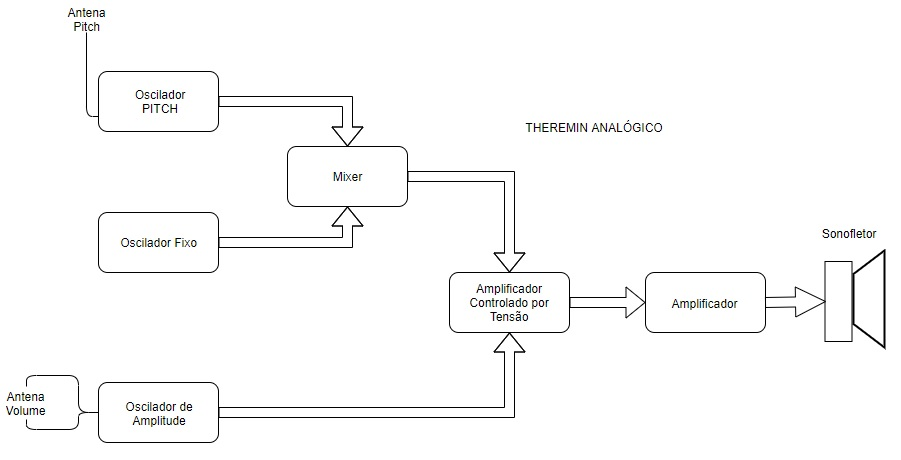
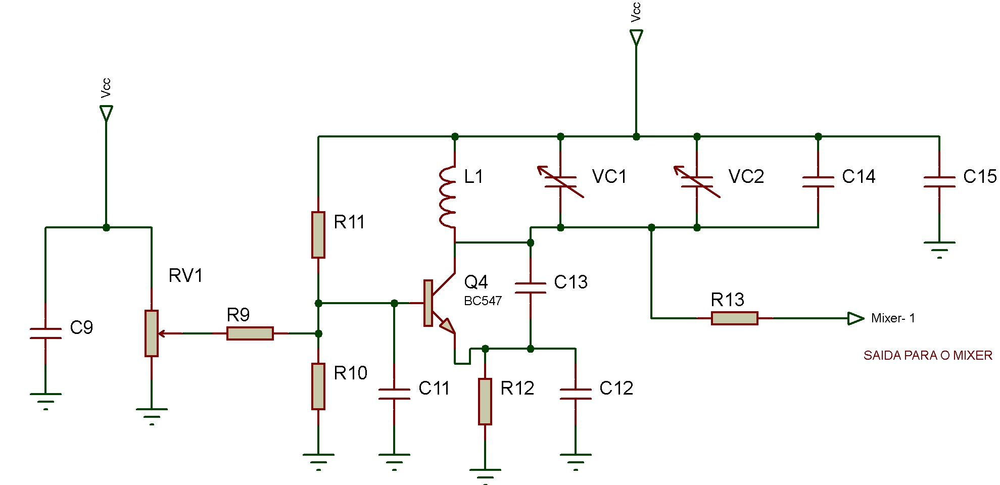
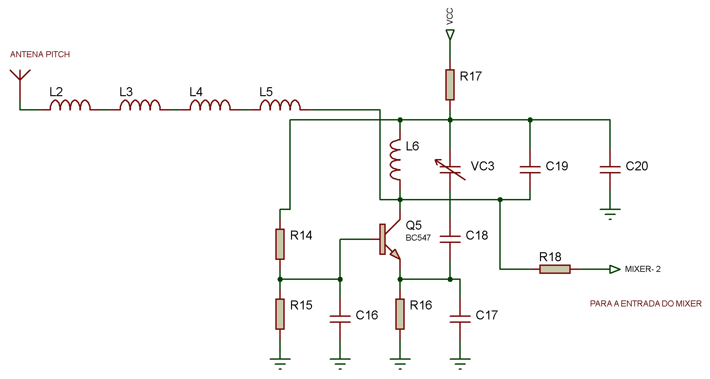
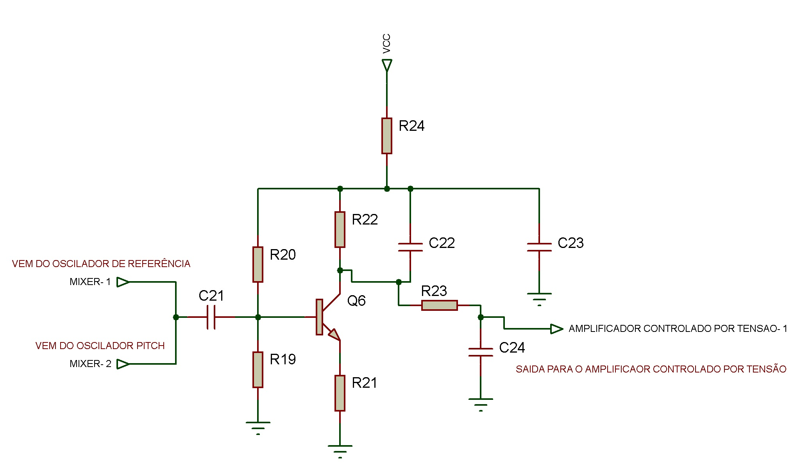
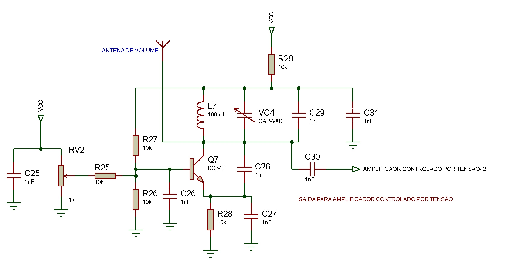
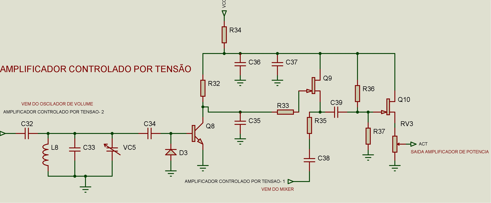
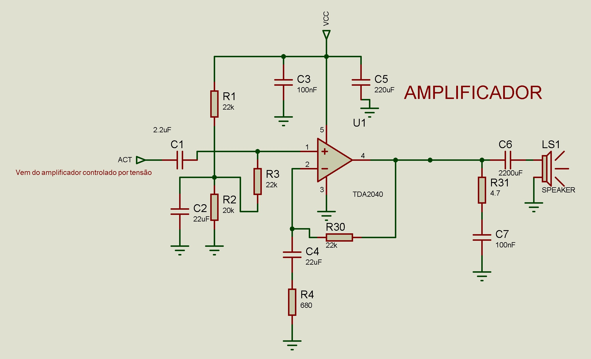
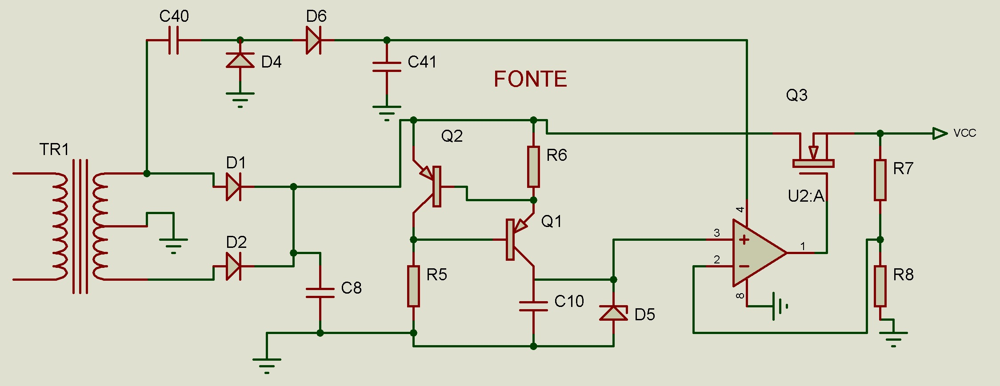

# SUMÁRIO
   
1. INTRODUÇÃO
2. CONCEPÇÃO
3. DESENHO
4. IMPLEMENTAÇÃO
5. OPERAÇÃO
6. REFERÊNCIAS

# 1. INTRODUÇÃO
O THEREMIN é um instrumento musical inventado  por Lev Sergeivitch Termen que após a guerra trocou seu nome para Leon Theremin. 
Provavelmente um dos primeiros, senão o primeiro, instrumento musical eletrônico do mundo foi inventado em 1919. Em 1929, logo após uma crise financeira, os direitos do instrumento foram vendido a empresa americana RADIO CORPORATION OF AMERICA (RCA) que lançou o produto “Thereminvox”. 

No THEREMIN analógico não existem cordas ou teclas e não é necessário contato com o instrumento, nele existem 2 antenas uma responsável pelo ajuste do volume e a outra pelo ajuste da tonalidade. Para utilizar o instrumento basta que o indivíduo aproxime ou afaste as mãos dessas antenas, variando assim a capacitância entre as antenas e corpo.

Figura1 - Theremin sendo tocado por uma senhora.

Para tocar o instrumento, geralmente, a mão direita controla frequência do som (tonalidade) enquanto que a esquerda controla a amplitude do som (volume). Movimentos rápidos com a mão direita próximos à antena vertical, que controla a frequência, produzem efeitos de vibrato. Movimentos rápidos com a mão esquerda na antena circular, que controla o volume, produzem efeitos de trêmolo. 

Figura 2 - Lev Theremin Tocando o instrumento por ele invnetado.

# CONCEPÇÃO

Conforme o Regulamento do projeto PI 1 2019- 2, é obrigatório que o projeto contenha:

* Circuitos Osciladores para Controle de Frequência - Para o controle de frequência serão utilizados 2 circuitos, um circuito oscilador fixo, que como o próprio nome apresenta, trata-se de um circuito de frequência fixa que servirá como uma referência. O outro circuito é conectado a antena de pitch (tonalidade) denominado oscilador de pitch, este circuito variará a frequência de oscilação conforme o campo elétrico gerado entre a mão do tocador e a antena.

* Mixer - O circuito Mixer ou misturador é responsável por fazer a (comparação) diferença  entre as frequências  provenientes do circuito oscilador fixo e do circuito oscilador de pitch. O resultado dessa comparação é enviado ao circuito amplificador controlado por tensão.

* Circuito Oscilador para Controle de amplitude - A antena de volume é conectada e este circuito e funciona de forma parecida com o circuito de pitch, é um circuito oscilador que varia a frequência de oscilação conforme a interação do tocador com a antena.

* Amplificador controlado por tensão - Este circuito é responsável por  receber os sinais produzidos pelo mixer e pelo controle de amplitude esses sinais serão processados e disponibilizados  na saída como resultante desses sinais.
Estágio para amplificação - A resultante do circuito controlado por tensão é recebido pelo estágio para amplificação, onde estes sinais serão amplificados e adequados para uma carga (sonofletor).

* Fonte interna - É o circuito responsável pela alimentação do circuito, trata-se de um Transformador abaixador com entrada 220/110V e saída +12 e -12, conectado a um retificador onda completa tap central, capacitores a fim de reduzir o ripple, reguladores de tensão e limites de corrente.  

* Gabinete - É o local onde estarão localizados e fixados todos os circuitos, as antenas, os conectores de alimentação e os botões necessários. Este compartimento será fabricado em madeira mdf, com tampa em acrílico e pés de borracha 

# DESENHO
O Projeto THEREMIN analogico é um conjunto de 7 Circuitos que serão conectados conforme diagrama de blocos.

Figura 3 - apresenta diagrama de blocos dos Circuito do THEREMIN

Vale destacar que o circuito da fonte nao esta apresentado no diagrama pois este circuito é responsável por alimentar eletricamente todos os outros 6 circuitos e o diagrama ficaria muito poluído visualmente com a apresentação desta.

- OSCILADOR 

Trata-se de um oscilador fixo que será utilizado como referência para o circuito, a base de todos os circuitos aqui apresentados foram apresentadas pelos professores orientadores da unidade curricular PI-1. Este circuito originalmente foi projetado para oscilar em torno de  172 KHz, frequência que pode sofrer um ajuste fino através do potenciômetro instalado no circuito. A saída deste circuito é ligada ao circuito MIXER.
- OSCILADOR PITCH

O circuito Oscilador PITCH será conectado a ANTENA PITCH,  frequência de oscilação varia neste circuito conforme a distância existente entre a mão e a antena, que formam uma capacitância parasita. A frequência de oscilação deste circuito deverá ser também de 172 KHz, e sua saída Também será conectada ao circuito MIXER.
- MIXER

A função do MIXER é misturar os sinais provenientes dos osciladores (FIXO e de PITCH) e produzir um sinal de áudio. Para que a frequência seja audível é necessário que seja realizado a diferença entre as duas frequências que entram no circuito. A saída deste circuito é conectada ao AMPLIFICADOR CONTROLADO POR TENSÃO.
- OSCILADOR DE AMPLITUDE

O circuito oscilador de volume é conectado a ANTENA DE VOLUME. Este circuito oscila na frequência de 441 KHz, está que variará conforme a distância entre a mão e a antena com o mesmo princípio do oscilador de pitch. Este circuito terá sua saída conectada ao Circuito AMPLIFICADOR CONTROLADO POR TENSÃO.
- AMPLIFICADOR CONTROLADO POR TENSÃO

Este circuito é o mais complexo do Theremin, pois ele recebe o sinal de áudio proveniente do Circuito MIXER e o amplifica com um GANHO que varia conforme os gestos da mão próxima a antena de volume. O AMPLIFICADOR CONTROLADO POR TENSÃO  recebe os sinais do MIXER e do OSCILADOR DE VOLUME  e tua sua saída conectada ao AMPLIFICADOR.

- AMPLIFICADOR

O AMPLIFICADOR é o responsável por receber o sinal do AMPLIFICADOR CONTROLADO POR TENSÃO  e adequá lo para a saída ou seja adequá lo para funcionamento do sonofletor (alto falante).

- FONTE INTERNA

A FONTE é o circuito responsável por toda a alimentação do THEREMIN. A fonte escolhida foi um modelo regulada por CMOS.

# IMPLEMENTAÇÃO
