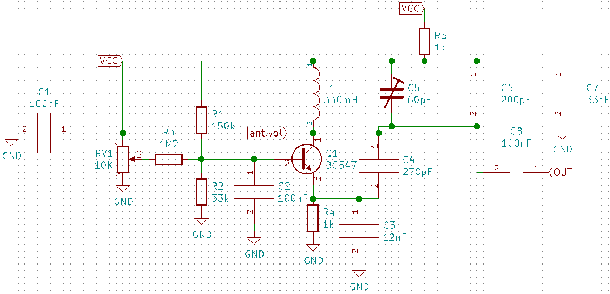

# SUMÁRIO
   
1. INTRODUÇÃO
2. CONCEPÇÃO
3. DESENHO
4. IMPLEMENTAÇÃO
5. OPERAÇÃO
6. REFERÊNCIAS

# 1. INTRODUÇÃO
O THEREMIN é um instrumento musical inventado  por Lev Sergeivitch Termen que após a guerra trocou seu nome para Leon Theremin. 
Provavelmente um dos primeiros, senão o primeiro, instrumento musical eletrônico do mundo foi inventado em 1919. Em 1929, logo após uma crise financeira, os direitos do instrumento foram vendido a empresa americana RADIO CORPORATION OF AMERICA (RCA) que lançou o produto “Thereminvox”. 

No THEREMIN analógico não existem cordas ou teclas e não é necessário contato com o instrumento, nele existem 2 antenas uma responsável pelo ajuste do volume e a outra pelo ajuste da tonalidade. Para utilizar o instrumento basta que o indivíduo aproxime ou afaste as mãos dessas antenas, variando assim a capacitância entre as antenas e corpo.

Figura1 - Theremin sendo tocado por uma senhora.

Para tocar o instrumento, geralmente, a mão direita controla frequência do som (tonalidade) enquanto que a esquerda controla a amplitude do som (volume). Movimentos rápidos com a mão direita próximos à antena vertical, que controla a frequência, produzem efeitos de vibrato. Movimentos rápidos com a mão esquerda na antena circular, que controla o volume, produzem efeitos de trêmolo. 

Figura 2 - Lev Theremin Tocando o instrumento por ele invnetado.

# CONCEPÇÃO

Conforme o Regulamento do projeto PI 1 2019- 2, é obrigatório que o projeto contenha:

* Circuitos Osciladores para Controle de Frequência - Para o controle de frequência serão utilizados 2 circuitos, um circuito oscilador fixo, que como o próprio nome apresenta, trata-se de um circuito de frequência fixa que servirá como uma referência. O outro circuito é conectado a antena de pitch (tonalidade) denominado oscilador de pitch, este circuito variará a frequência de oscilação conforme o campo elétrico gerado entre a mão do tocador e a antena.

* Mixer - O circuito Mixer ou misturador é responsável por fazer a (comparação) diferença  entre as frequências  provenientes do circuito oscilador fixo e do circuito oscilador de pitch. O resultado dessa comparação é enviado ao circuito amplificador controlado por tensão.

* Circuito Oscilador para Controle de amplitude - A antena de volume é conectada e este circuito e funciona de forma parecida com o circuito de pitch, é um circuito oscilador que varia a frequência de oscilação conforme a interação do tocador com a antena.

* Amplificador controlado por tensão - Este circuito é responsável por  receber os sinais produzidos pelo mixer e pelo controle de amplitude esses sinais serão processados e disponibilizados  na saída como resultante desses sinais.
Estágio para amplificação - A resultante do circuito controlado por tensão é recebido pelo estágio para amplificação, onde estes sinais serão amplificados e adequados para uma carga (sonofletor).

* Fonte interna - É o circuito responsável pela alimentação do circuito, trata-se de um Transformador abaixador com entrada 220/110V e saída +12 e -12, conectado a um retificador onda completa tap central, capacitores a fim de reduzir o ripple, reguladores de tensão e limites de corrente.  

* Gabinete - É o local onde estarão localizados e fixados todos os circuitos, as antenas, os conectores de alimentação e os botões necessários. Este compartimento será fabricado em madeira mdf, com tampa em acrílico e pés de borracha 

# DESENHO
O Projeto THEREMIN analogico é um conjunto de 7 Circuitos que serão conectados conforme diagrama de blocos.

Figura 3 - apresenta diagrama de blocos dos Circuito do THEREMIN

Vale destacar que o circuito da fonte nao esta apresentado no diagrama pois este circuito é responsável por alimentar eletricamente todos os outros 6 circuitos e o diagrama ficaria muito poluído visualmente com a apresentação desta.

- OSCILADOR 

Trata-se de um oscilador fixo que será utilizado como referência para o circuito, a base de todos os circuitos aqui apresentados foram apresentadas pelos professores orientadores da unidade curricular PI-1. Este circuito originalmente foi projetado para oscilar em torno de  172 KHz, frequência que pode sofrer um ajuste fino através do potenciômetro instalado no circuito. A saída deste circuito é ligada ao circuito MIXER.
- OSCILADOR PITCH

O circuito Oscilador PITCH será conectado a ANTENA PITCH,  frequência de oscilação varia neste circuito conforme a distância existente entre a mão e a antena, que formam uma capacitância parasita. A frequência de oscilação deste circuito deverá ser também de 172 KHz, e sua saída Também será conectada ao circuito MIXER.
- MIXER

A função do MIXER é misturar os sinais provenientes dos osciladores (FIXO e de PITCH) e produzir um sinal de áudio. Para que a frequência seja audível é necessário que seja realizado a diferença entre as duas frequências que entram no circuito. A saída deste circuito é conectada ao AMPLIFICADOR CONTROLADO POR TENSÃO.
- OSCILADOR DE AMPLITUDE

O circuito oscilador de volume é conectado a ANTENA DE VOLUME. Este circuito oscila na frequência de 441 KHz, está que variará conforme a distância entre a mão e a antena com o mesmo princípio do oscilador de pitch. Este circuito terá sua saída conectada ao Circuito AMPLIFICADOR CONTROLADO POR TENSÃO.
- AMPLIFICADOR CONTROLADO POR TENSÃO

Este circuito é o mais complexo do Theremin, pois ele recebe o sinal de áudio proveniente do Circuito MIXER e o amplifica com um GANHO que varia conforme os gestos da mão próxima a antena de volume. O AMPLIFICADOR CONTROLADO POR TENSÃO  recebe os sinais do MIXER e do OSCILADOR DE VOLUME  e tua sua saída conectada ao AMPLIFICADOR.

- AMPLIFICADOR

O AMPLIFICADOR é o responsável por receber o sinal do AMPLIFICADOR CONTROLADO POR TENSÃO  e adequá lo para a saída ou seja adequá lo para funcionamento do sonofletor (alto falante).

- FONTE INTERNA

A FONTE é o circuito responsável por toda a alimentação do THEREMIN. A fonte escolhida foi um modelo regulada por CMOS.

# IMPLEMENTAÇÃO

Para a implementação dos circuitos necessários para a construção do THEREMIN foi utilizado o SOFTWARE KICAD para a criação do esquematico e o layout de PCI e os SOFTWARES PROTEUS e LTSPACE para simulações necessárias.

- OSCILADOR 

ESQUEMA DO CIRCUITO OSCILADOR FIXO

Espera- se que com esta montagem o oscilador Oscile com uma frequencia de 172KHz, sendo essa sofrendo ajuste fino através do potenciomentro manuseado pelo usuario do instrumento ou TRIMMER durante sua montagem/ fabricação.

LAYOUT PARA PLACA DE CIRCUITO IMPRESSO CIRCUITO OSCILADOR FIXO

Para a implementação deste circuito serão utilizados 6 capacitores, 5 resistores, 2 capacitores variáveis (trimmer), 2 terminais tipo t block 2entradas, potenciometro, indutor e um transistor. sendo:
C1= 0,1uF
C2= 0,1uF
C3= 0,033uF (33nF)
C4= 680pF
C5= 0 - 60pF
C6= 0 - 60pF
C7= 200pF
C8= 0,033uF (33nF)
RV= 10K
R1= 330K
R2= 150K
R3= 33K
R4= 1K
R5= 330K
L1= 1mH
Q1= BC547

- OSCILADOR PITCH

ESQUEMA DO CIRCUITO OSCILADOR PITCH

Espera- se que com esta montagem o OSCILADOR PITCH  também oscile em uma frequência de 172KHz. A antena pitch será resposavel por auterar essa frequência conforme o ususario interagim com ela.

LAYOUT DE PLACA DE CIRCUITO IMPRESSO CIRCUITO OSCILADOR PITCH

O circuito Oscilador PITCH utilizará 5 indutores, 5 capacitores, 5 resistores, 3 terminais T block, capacitor variavel e transistor. Sendo:
L1= 10mH
L2= 10mH
L3= 10mH
L4= 10mH
L5= 1mH
C1= 100nF
C2= 33nF
C3= 680pF
C4= 200pF
C5= 33nF
C6= 0 - 60pF
R1= 150K
R2= 33K
R3= 1K
R4= 1K
R5= 330K
Q1= BC547

- MIXER

ESQUEMA DO CIRCUITO MIXER

O circuito MIXER recebe o sinal proviniente dos circuitos ateriormente descritos ( OSCILADOR FIXO e OSCILADOR PITCH). Por sua vez terá a função de realizar a diferença entre esses sinais recebidos permitindo em sua saida um sinal com frequência que a audição HUMANA reconheça/perceba.

LAYOUT DE PLACA DE CIRCUITO IMPRESSO CIRCUITO MIXER

O circuito MIxer utilizara em sua contrução 4 Capacitores, 6 resistores, 3 terminais T block e transistor. Sendo:
C1= 1nF
C2= 4,7nF
C3= 100nF
C4= 4,7nF
R1= 100K
R2= 560K
R3= 1K
R4= 6,8K
R5= 1K
R6= 1K
Q1= BC547

- OSCILADOR DE AMPLITUDE

ESQUEMA CIRCUITO OSCILADOR DE VOLUME

Espera- se que com esta montagem o Oscilador de AMPLITUDE oscile com 441KHz e tenha comportamente semelhante ao oscilador PITCH, ao interagir com a antena de volume esta frequencia variará.

LAYOUT DE PLACA DE CIRCUITO IMPRESSO PARA OS CIRCUITO OSCILADOR DE VOLUME

Para a montagem do circuito oscilador de volume será necessário 7 capacitores, 5 ressitores,3 termminais tipo T block, indutor, potenciomentro, capacitor variavel e transistor. Sendo:
C1= 100nF
C2= 100nF
C3= 12nF
C4= 270pF
C5= 0 - 60pF
C6= 280pF
C7= 33nF
C8= 100nF
RV1= 10K
R1= 150K
R2= 33K
R3= 1,2M
R4= 1K
L1= 330mH
Q1= BC547

- AMPLIFICADOR CONTROLADO POR TENSÃO

ESQUEMA DO CIRCUITO AMPLIFICADOR CONTROLADO POR TENSÃO

Este circuito recebe os sinais provenientes do OSCILADOR DE AMPLITUDE e do MIXER. Seu papel é controlar o volume de acordo com o Sinal proveniente do OSCILADOR DE AMPLITUDE. Ou seja na sua saida existirá o SINAL proveniente do MIXER ATENUADO ou AMPLIFICADO conforme situação da antena de volume.

LAYOUT PLACA DE CIRCUITO IMPRESSO PARA O AMPLIFICADOR CONTROLADO POR TENSÃO.

Para a montagem deste circuito será necessário 7 capacitores,5 ressitores, 3 transistores, 4 terminais tipo T block, indutor, capacitor variavel, diodo e potenciometro. sendo:
C1= 4,7pF
C2= 227pF
C3= 0 - 60pF
C4= 4,7pF
C5= 100pF
C6= 100pF
C7= 10uF
C8= 1pF
R1= 10K
R2= 470K
R3= 1K
R4= 1K
R5= 4,7M
Q1= BC547
Q2= 2N5486
Q3= 2N5486
L1= 330mH
D1= 1N4007
RV1= 10K

- AMPLIFICADOR

ESQUEMA CIRCUITO AMPLIFICADOR

Este circuito terá como função amplificar o sinal proveniente do AMPLIFICADOR CONTROLADO POR TENSÃO, e adequalo para o sonofletor (alto-falante).

LAYOUT PLACA DE CIRCUITO IMPRESSO CIRCUITO AMPLIFICADOR

Para a montagem desse circuito será necessário 6 capacitores, 7 resistores, amplificador tipo TDA, 2 terminal tipo T block e led. Sendo:
C1= 2,2uF
C2= 22uF
C3= 220uF
C4= 22uF
C5= 100nF
C6= 100nF
C7= 2200uF
R1= 22K
R2= 20K
R3= 22K
R4= 680
R5= 22K
R6= 4,7
R7= 500
U1= TDA2050
D1= LED 2,2V 200mA

- FONTE INTERNA

ESQUEMA CIRCUITO FONTE INTERNA.

Este circuito é responsavel por alimentar todos os outro circuitos com 12VCC. Foi optado por trabalhar com retificação em TAP central, trata- se de 1 transformador com o primario ligado na rede 220Vac e seu secundário subdividido em 12 + 12Vac, essa tensão reduzida e isolada eletricamente da REDE é retificada por 2 diodos que permitem uma tensão continua pulsante. Esta tensão é filtrada por um capacitor diminuindo assim este nivel de pulso (ripple). Para tornar a tensão constante foi utilizado um regulador de tensão.

LAYOUT PLACA DE CIRCUITO IMPRESSO FONTE INTERNA.

Para a montagem desse circuito será necessário 5 Capacitores, 2 Diodos, regulador linear e 2 terminais tipo T block. Sendo:
D1= 1N4007
D2= 1N4007
C1= 4700uF
C2= 10nF
C3= 10nF
C4= 100nF
C5= 1uF
U1= LM7812